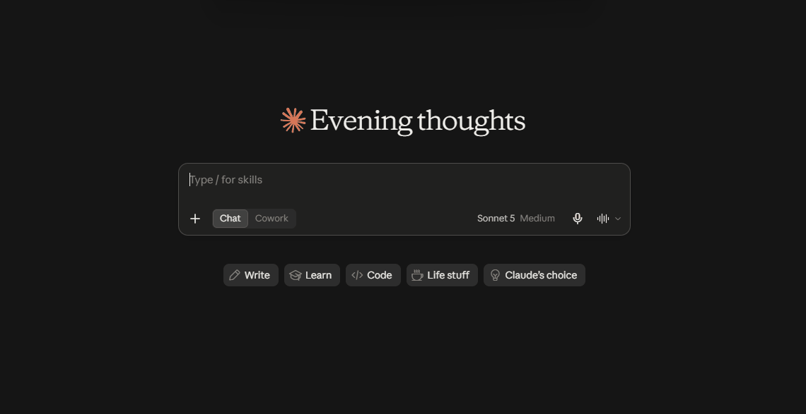
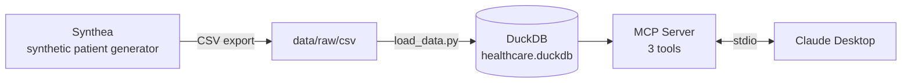

# MCP Healthcare Triage Assistant

An MCP (Model Context Protocol) server that lets Claude act as a **triage /
EHR copilot**: querying a synthetic patient database in natural language to
surface clinical history, current medications, and known drug interactions
— combining structured tool data with the model's own clinical reasoning.

Built as a hands-on, from-scratch data engineering portfolio project —
100% free/open-source stack, no paid services, no Kaggle datasets.

 

## Why this project

Most portfolio projects show a static dashboard or a notebook. This one
shows an LLM **actually using** a data pipeline, live, over natural
language — the same integration pattern (MCP) companies are adopting right
now to connect AI assistants to their own data.

## Architecture



## Stack

| Layer            | Tool                                                                 |
|------------------|-----------------------------------------------------------------------|
| Synthetic data   | [Synthea](https://github.com/synthetichealth/synthea) (Java, containerized) |
| Database         | [DuckDB](https://duckdb.org/)                                        |
| Server           | Python 3.11, [MCP Python SDK](https://github.com/modelcontextprotocol/python-sdk) |
| Containerization | Docker + Docker Compose                                              |
| Tests            | pytest                                                                |
| Client           | Claude Desktop                                                        |

All free, all open-source, all running locally — no cloud costs.

## The 3 tools

| Tool                       | What it does                                                        |
|-----------------------------|----------------------------------------------------------------------|
| `get_patient_history`        | Past diagnoses, recorded allergies, and past procedures for a patient |
| `get_current_medications`    | Medications with no recorded stop date (still active)                |
| `check_drug_interaction`     | Looks up a pair of medications against a curated reference table     |

## See it in action

**Scenario 1 — the reference table catching a real interaction:**

> **Prompt:** *"Can this patient start taking Aspirin?"*
>
> **Claude:** Not recommended without medical evaluation. Interaction
> found: Aspirin + Warfarin → **major**, increased bleeding risk. This
> patient has been on Warfarin since 2012. Also flags aggravating clinical
> context pulled from the same patient's history: aortic valve
> replacement, osteoporosis with a prior fracture, hospice care record.

**Scenario 2 — the model reasoning beyond the reference table:**

> **Prompt:** *"Can this patient take Aspirin, given their other
> medications?"*
>
> **Claude:** The patient already takes Aspirin (since 1988) — not a new
> medication. Checked it against every other current medication: no match
> in the reference table. **Flagged on its own:** the patient is also on
> Naproxen (another NSAID) — combining two NSAIDs/aspirin raises a real,
> well-established GI bleeding risk that isn't in this project's demo
> table.

This is the actual point of the project: structured tool data plus the
model's own reasoning — not a lookup table pretending to be a clinical
system.

## Setup

Requires: Docker Desktop, Python 3.11, and (on Windows) WSL2.

```bash
# 1. Clone and enter the project
git clone https://github.com/Luiz-mila/mcp-healthcare-triage.git
cd mcp-healthcare-triage

# 2. Create and activate a virtual environment (matches the Docker image's Python version)
python3.11 -m venv venv
source venv/bin/activate      # Windows/WSL and Linux
pip install -r requirements.txt

# 3. Configure environment variables
cp .env.example .env

# 4. Generate synthetic patient data (Synthea, via Docker — no local Java needed)
docker compose build synthea
docker compose run --rm synthea

# 5. Load the data into DuckDB
python src/load_data.py

# 6. Run the test suite
pytest -v
```

Then connect it to Claude Desktop: **Settings → Developer → Edit Config**,
add this project under `mcpServers` (see
`docs/claude_desktop_config.example.json`). The example there targets
Windows + WSL (it wraps the command in `wsl.exe`, since Claude Desktop
runs natively on Windows and can't see a WSL virtual environment
directly); on macOS/Linux, drop the `wsl.exe`/`bash -lc` wrapper and point
`command` straight at `venv/bin/python` with `args: ["src/server.py"]`.
Restart Claude Desktop completely after saving.

## Project structure

mcp-healthcare-triage/
├── data/
│ ├── raw/   # Synthea's raw CSV output (gitignored)
│ └── processed/   # the DuckDB file (gitignored)
├── docker/
│ └── synthea.Dockerfile
├── src/
│ ├── load_data.py   # Synthea CSVs -> DuckDB
│ └── server.py # the MCP server (3 tools)
├── tests/
│ └── test_server.py
├── docker-compose.yml
├── Dockerfile
└── requirements.txt


## Disclaimer

- All patient data is **synthetic**, generated by [Synthea](https://github.com/synthetichealth/synthea) — no real patient data was used at any point.
- The `drug_interactions` table is a small, hand-curated demo dataset (5 rows) — **not** a clinical source of truth. This project is a portfolio/learning exercise, not a medical device. Do not use it for real medical decisions.

## Status

- [x] Project scaffold, requirements.txt, .gitignore, Docker setup
- [x] Synthetic data generation (Synthea, containerized)
- [x] DuckDB loading pipeline
- [x] MCP server with 3 tools
- [x] Claude Desktop integration
- [x] Automated tests + real-world test scenarios
- [x] Demo GIF/video

## About the Author

**Luiz Milaré**
Data Engineer | SQL · Python · Airflow · PostgreSQL · Docker · Snowflake · AWS · Power BI

📍 London, United Kingdom
📧 [milahercu@gmail.com](mailto:milahercu@gmail.com)
🔗 [GitHub](https://github.com/Luiz-mila) · [LinkedIn](https://www.linkedin.com/in/luiz-milar%C3%A9)

Data Engineer and BI Analyst with hands-on experience building ETL pipelines, data warehouses, and analytical dashboards, including prior work on sensitive medical datasets for AI model fine-tuning. RNCP Level 6 certified in Data Engineering, with a BSc in Computer Science and a Snowflake SQL certification. Fluent in Portuguese, French, English, and Italian, working across international data environments with a focus on healthcare, finance, and e-commerce domains.